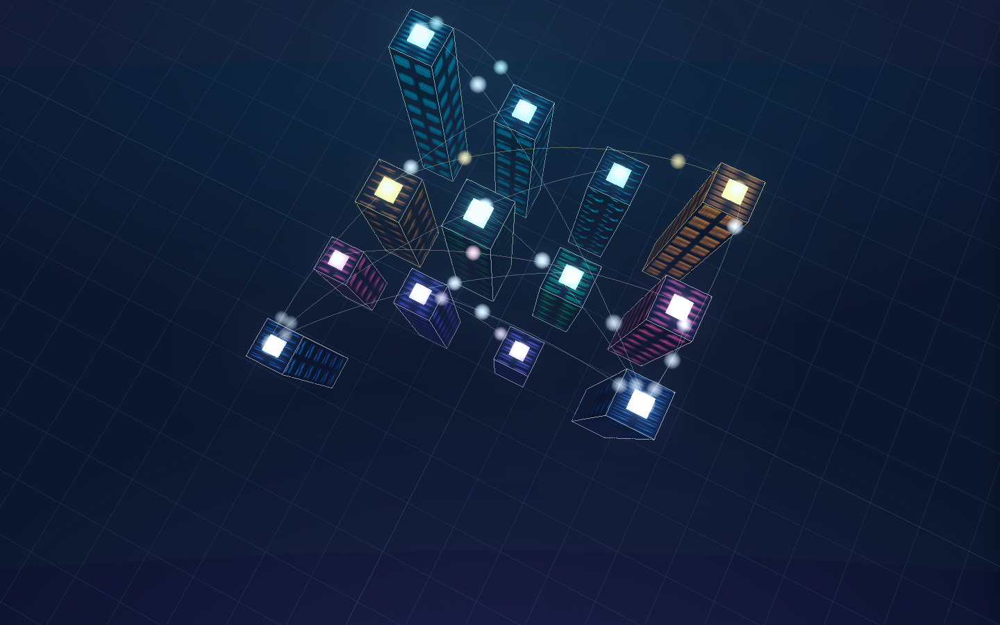

# Bizzapps City · Interactive 3D Portfolio (Proof of Concept)

An interactive, animated **3D city** where every building is one of the business
applications we've delivered. Fly into the skyline, orbit around it, filter by
district (industry), and click any tower to see that project's story and impact.

Built as a leadership- and client-facing proof of concept — **not a slideshow**.
Real-time WebGL (three.js), neon-night art direction, animated data-flow arcs,
and a live impact HUD.



---

## What's in the experience

| Feature | Detail |
|---|---|
| **Fly-in intro** | Brand screen with headline stats, then a cinematic camera descent into the city. |
| **A building per app** | Height encodes business impact; colour encodes the industry "district". |
| **Living skyline** | Emissive windows, glowing edges, rooftop beacons, an ambient star field and bloom. |
| **Animated data flows** | Glowing pulses travel along arcs between connected apps (integrations / shared platform). |
| **Click to dive in** | The camera frames the tower and a panel slides in with the story, feature chips, connected apps, and impact metrics that count up. |
| **District filter** | Click a district chip to spotlight one industry and dim the rest. |
| **Fully interactive** | Drag to orbit, scroll to zoom. Auto-rotates when idle. |
| **Robust** | Reduced-motion aware, WebGL fallback message, responsive, keyboard `Esc` to close. |

---

## Editing the content — the only file you touch

All content lives in **[`src/data.js`](src/data.js)** (`window.SHOWCASE`). Replace the
placeholder projects with your real work and the whole city rebuilds itself:

```js
{
  id: "atlas",                 // unique id (used by `flows`)
  name: "Atlas Treasury",
  client: "Regional bank · 4 countries",
  district: "fin",             // must match a district id below
  year: 2025,
  impact: 96,                  // 0–100 → drives building HEIGHT
  summary: "…one or two sentences…",
  features: ["Live liquidity map", "Automated reconciliation"],
  metrics: [                   // these count up in the side panel
    { label: "Manual hours cut", value: 41000, suffix: "/yr" },
    { label: "Close time",       value: -73,   suffix: "%"   },
  ],
}
```

- **Districts** (industries + colours) and **headline stats** are also in that file.
- **`flows`** is an optional list of `[fromId, toId]` links drawn as data arcs.
  Leave it empty and the platform apps in the `data` district auto-connect to everything.

> The placeholder projects are illustrative structure only — swap in real names,
> clients, and numbers before presenting.

---

## Run it

**Just open the file** — `index.html` is fully self-contained (three.js is vendored
and inlined at build time), so it runs by double-clicking, offline. For local dev
you can also serve the folder:

```bash
python3 -m http.server 8080   # then visit http://localhost:8080
```

## Build

`index.html` and `artifact.html` are generated from `src/` + `vendor/`:

```bash
./build.sh
```

- `index.html` — standalone document (present this / host it anywhere).
- `artifact.html` — body-only build used to publish the Claude Artifact.

## Project layout

```
src/
  data.js      ← YOUR CONTENT (projects, districts, stats, flows)
  app.js       ← the three.js scene + all interaction
  styles.css   ← interface / HUD / panel styling
  body.html    ← DOM overlay markup
vendor/        ← three.js r128 + OrbitControls + bloom post-processing (MIT)
build.sh       ← assembles the two HTML outputs
index.html     ← built · standalone
artifact.html  ← built · for Artifact publishing
```

## Embedding / driving the demo

A small control API is exposed on `window.BizzappsCity` for remote clickers,
kiosks, or embedding:

```js
BizzappsCity.enter();            // start the fly-in
BizzappsCity.select("atlas");    // open a project by id (or index)
BizzappsCity.district("fin");    // spotlight a district
BizzappsCity.reset();            // back to the overview
```

---

three.js is © its authors, MIT-licensed (see `vendor/`).
